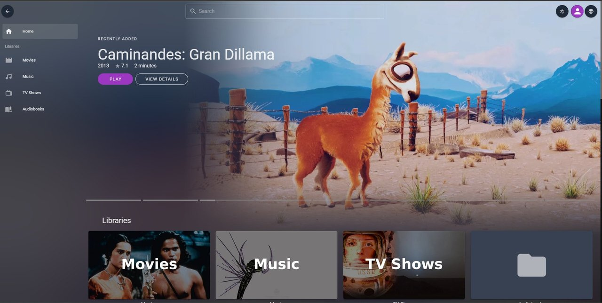

<!--
Este archivo README esta generado automaticamente<https://github.com/YunoHost/apps/tree/master/tools/readme_generator>
No se debe editar a mano.
-->

# Jellyfin Vue Client para Yunohost

[](https://ci-apps.yunohost.org/ci/apps/jellyfin-vue/)


[](https://install-app.yunohost.org/?app=jellyfin-vue)

*[Leer este README en otros idiomas.](./ALL_README.md)*

> *Este paquete le permite instalarJellyfin Vue Client rapidamente y simplement en un servidor YunoHost.*  
> *Si no tiene YunoHost, visita [the guide](https://yunohost.org/install) para aprender como instalarla.*

## Descripción general

Jellyfin Vue is the next step of Jellyfin's development. It's a new frontend, based on Vue. See https://jellyfin.org/posts/vue-vue3 for details.


**Versión actual:** 2024.12.29~ynh1

**Demo:** <https://jf-vue.pages.dev>

## Capturas



## Documentaciones y recursos

- Repositorio del código fuente oficial de la aplicación : <https://github.com/jellyfin/jellyfin-vue>
- Catálogo YunoHost: <https://apps.yunohost.org/app/jellyfin-vue>
- Reportar un error: <https://github.com/YunoHost-Apps/jellyfin-vue_ynh/issues>

## Información para desarrolladores

Por favor enviar sus correcciones a la [rama `testing`](https://github.com/YunoHost-Apps/jellyfin-vue_ynh/tree/testing).

Para probar la rama `testing`, sigue asÍ:

```bash
sudo yunohost app install https://github.com/YunoHost-Apps/jellyfin-vue_ynh/tree/testing --debug
o
sudo yunohost app upgrade jellyfin-vue -u https://github.com/YunoHost-Apps/jellyfin-vue_ynh/tree/testing --debug
```

**Mas informaciones sobre el empaquetado de aplicaciones:** <https://yunohost.org/packaging_apps>
